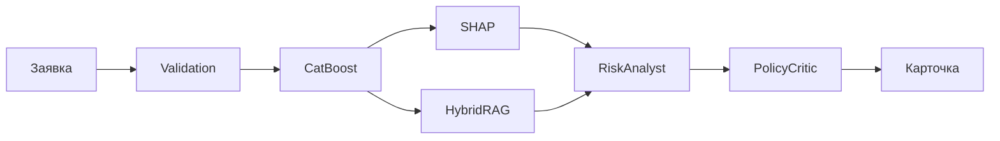

# От заявки до решения

Пользователь выбирает один из шести синтетических клиентов или заполняет форму. FastAPI принимает `POST /api/analyze` и запускает LangGraph.

Карточка всегда берёт `decision`, `score` и `risk_band` из `ScoringResult`. LLM пишет только текст.

