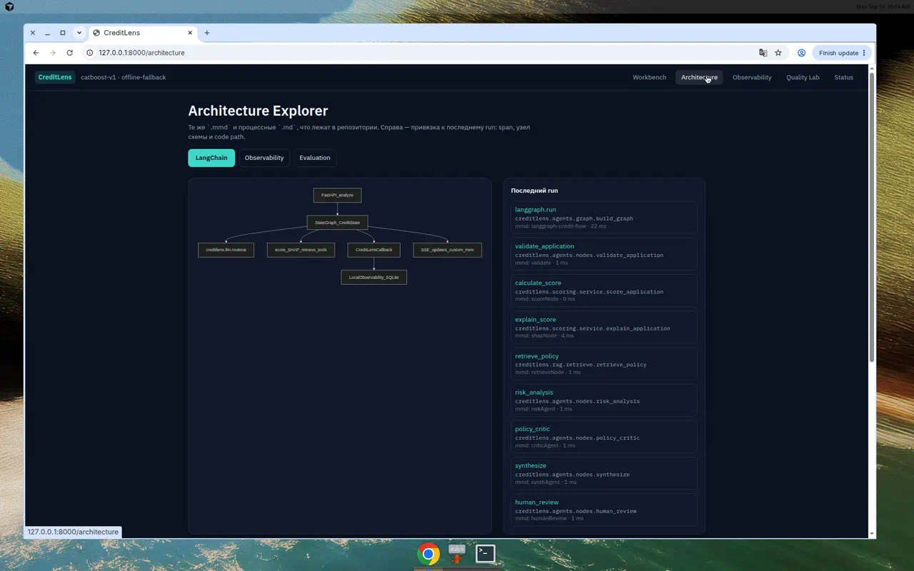

# Как LangChain / LangGraph участвуют в процессе

Технический путь:

1. `creditlens.llm.routerai.chat_model()` создаёт `ChatOpenAI` с `base_url=https://routerai.ru/api/v1`. Граф не знает провайдера.
2. `StateGraph(CreditState)` оркестрирует узлы. Score пишет только `calculate_score`.
3. Параллельные рёбра: после scoring идут `explain_score` и `retrieve_policy`, затем join в `risk_analysis`.
4. `policy_critic` может вернуть выполнение в `retrieve_more` (цикл).
5. Стрим: `graph.stream(..., stream_mode="updates")` → SSE `node_start/node_end/tool/retrieval`.
6. Если `LLM_API_KEY` пуст, агенты работают детерминированными шаблонами на SHAP+RAG — CI и демо без ключа не ломаются.

Код-пути, которые показывает Architecture Explorer:

- `creditlens.agents.graph.build_graph`
- `creditlens.scoring.service.score_application`
- `creditlens.rag.retrieve.retrieve_policy`
- `creditlens.llm.routerai.chat_model`

