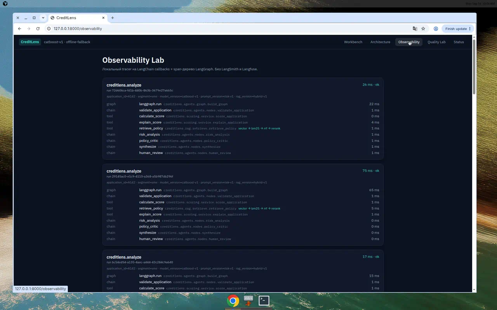

# Как observability сидит в процессе

Каждый analyze создаёт `traces` + дерево `spans` в SQLite и, если настроен, тот же run в Langfuse OSS.

- `start_trace` пишет metadata: `application_id`, `model_version`, `prompt_version`, `rag_version`.
- Span стартует до тела node и заканчивается после — duration это wall-clock.
- Retrieval пишет события `vector`, `bm25`, `rrf`, `rerank`.
- `CreditLensCallback` ловит LangChain LLM/tool callbacks.
- LangSmith — тот же Observability protocol. Без ключа health = `ready_no_key`, не «выключено нарочно».

