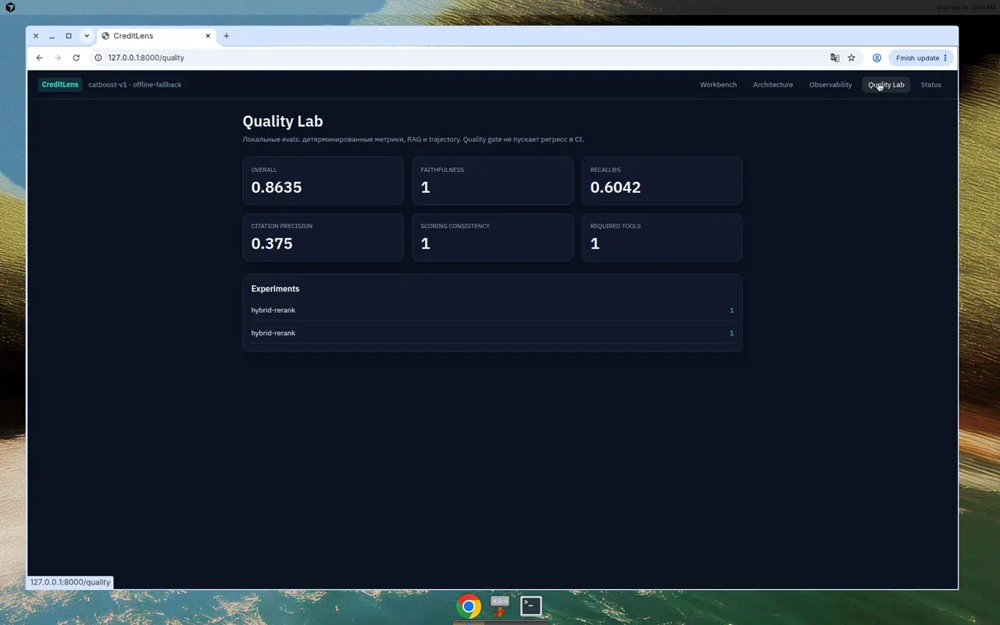

# Как evaluation закрывает контур

Датасеты: `evals/datasets/{scoring,rag,explanation,agent}_cases.jsonl`.

Варианты pipeline:

- `vector-only` — только vector, ожидаемый FAIL
- `hybrid` — vector + BM25 + RRF
- `hybrid-rerank` — production, deploy gate
- `bad-prompt` — выдуманная цитата, ожидаемый FAIL

Слои:

- детерминированные: `scoring_consistency`, `structured_output`, `numeric_consistency`, `scoring_tool_called`, `agent_tool_usage`
- RAG: Recall@5, MRR, citation precision
- `citation_grounding`: цитаты ⊆ retrieved documents
- `faithfulness`: LLM-as-a-Judge, только если есть RouterAI ключ

Раннер пишет SQLite и `evals/experiments/<name>/results.json`. Release workflow: test → eval → deploy.

